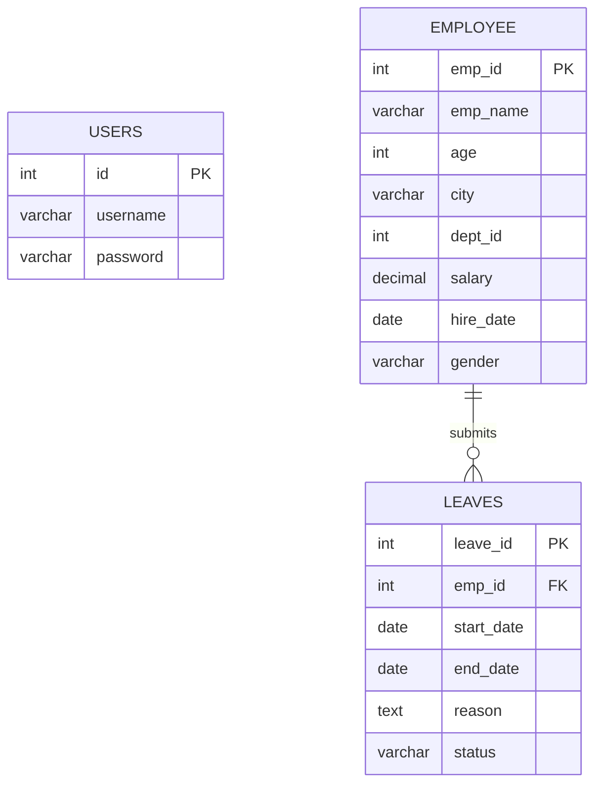
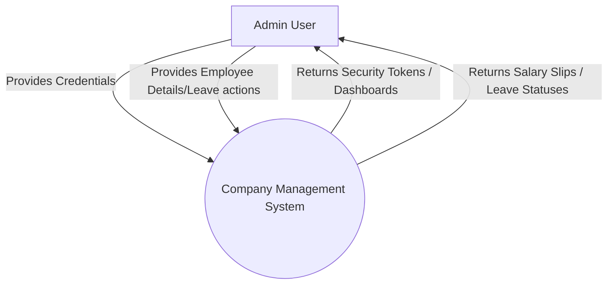
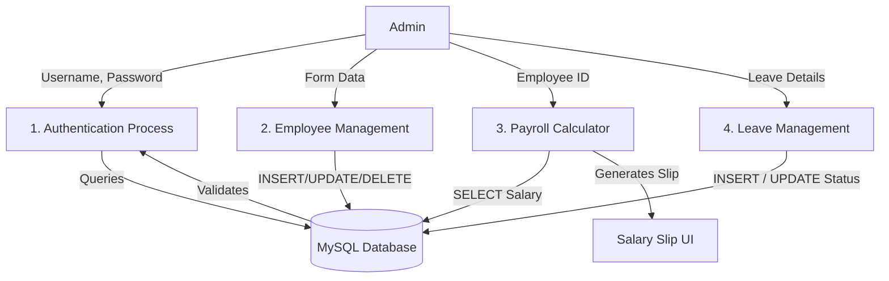

# Project Report: Company Database Management System

---
nsfer Protocol
* **HRA** - House Rent Allowance
* **DA** - Dearness Allowance

---

## 2. Abstract
The **Company Management System (CMS)** is a comprehensive, web-based software solution designed specifically to streamline administrative processes, employee tracking, and payroll operations within a modern organization. Traditionally, organizations rely on distributed spreadsheets or manual ledger entries to record employee details, track leave requests, and compute monthly salaries. These manual methods are historically prone to human error, data redundancy, and significant time overhead.

This project addresses these fundamental inefficiencies by centralizing corporate data into a unified platform. Utilizing Python's Flask web framework for the backend and a robust Relational Database Management System (MySQL), the application offers an intuitive, browser-based interface through which administrators can securely log in and manage organizational data. Core functionalities include executing fundamental CRUD (Create, Read, Update, Delete) operations on employee records, automating the arithmetic behind salary slip generation, and facilitating an autonomous Leave Management pipeline. By abstracting the complexities of database administration behind an accessible graphical interface, the CMS ensures data integrity, significantly reduces administrative workload, and presents a scalable architecture capable of evolving alongside business requirements.

---

## 3. Introduction
In the contemporary corporate landscape, effective human resource management is a cornerstone of organizational success. As companies scale, the volume of employee data—encompassing personal details, department allocations, financial compensations, and absence records—grows exponenti
## 1. Abbreviations
* **CMS** - Company Management System
* **UI** - User Interface
* **UX** - User Experience
* **HTML** - HyperText Markup Language
* **CSS** - Cascading Style Sheets
* **SQL** - Structured Query Language
* **DBMS** - Database Management System
* **ERD** - Entity Relationship Diagram
* **DFD** - Data Flow Diagram
* **HTTP** - Hypertext Traally. The Company Management System (CMS) was conceptualized to serve as a digital liaison between administrative personnel and this expanding dataset.

The system is engineered as a monolithic web application that prioritizes ease-of-use and reliability. It mandates administrator authentication to prevent unauthorized data mutations, thereby enforcing institutional security policies at the application tier. Once authenticated, administrators interact with a clean, responsive dashboard that communicates seamlessly with a MySQL backend. Data is retrieved, parsed, and rendered dynamically into HTML templates, allowing for immediate insight into workforce metrics. Ultimately, the introduction of this software aims to eliminate physical paperwork, mitigate computational errors inherent in payroll, and establish a digital-first approach to traditional corporate administration.

---

## 4. Project Overview
The project is fundamentally a secure, data-driven web application following the classic Client-Server architecture. 

**Technology Stack:**
* **Frontend:** HTML5, CSS3, Jinja2 Templating
* **Backend:** Python 3, Flask Web Framework
* **Database:** MySQL
* **Connector:** `mysql-connector-python`

**Architectural Paradigm:**
The application strictly follows a Model-View-Controller (MVC) architectural pattern:
* **Model:** Represented by the MySQL database executing relational queries and the `mysql-connector` abstracting the data layer.
* **View:** Consists of the Jinja2 infused HTML templates (`index.html`, `login.html`, `salary.html`, `leaves.html`) that serve as the presentation layer.
* **Controller:** Built within `app.py`, these routing functions intercept HTTP requests, enforce session-based security, query the database, calculate required metrics, and return the populated views.

---

## 5. Objective of the Project
The primary objectives of the CMS project are:
1. **Centralization of Data:** To provide a single source of truth for all employee-related data, eliminating data silos.
2. **Administrative Efficiency:** To allow HR administrators to instantaneously add, edit, or remove employee records without writing database queries.
3. **Automated Payroll Calculations:** To automatically calculate Gross Salary, Net Salary, tax deductions, and allowances dynamically, generating an instant, print-ready digital salary slip.
4. **Transparent Leave Tracking:** To offer a dedicated interface for logging employee leave requests, ensuring that managers can systematically approve or reject applications without losing track of pending requests.
5. **Data Security:** To ensure that sensitive internal data is shielded from the public via enforced authentication mechanisms and session tracking.

---

## 6. Scope of the Project
The current iteration of the project serves as an administrative portal configured for centralized HR management.

**In-Scope:**
* Secure Admin Login and Session Management.
* Management of Employee metadata (ID, Name, Age, City, Department, Base Salary, Hire Date, Gender).
* Generation of real-time Salary Slips with pre-defined tax bracket logic.
* Leave Management capabilities bridging the gap between employee constraints and HR approvals.

**Out-of-Scope:**
* Multi-user hierarchical logins (e.g., individual employee accounts logging in to view their own data independently).
* Integrated email notifications or SMS gateways for leave request statuses.
* Third-party payroll banking integrations.

---

## 7. System Design
The System Design of CMS is defined by its modular template rendering and stateless HTTP protocol, managed via Flask's routing decorators.

1. **Client Tier:** The user's web browser, which renders HTML/CSS and captures user inputs through heavily validated semantic `<form>` elements.
2. **Application Tier (Flask):** The middleware that acts as the brain of the application. It receives form data, verifies the active `session['logged_in']` token, and formulates SQL constraints.
3. **Data Tier (MySQL):** The persistent storage layer maintaining referential integrity across multiple tables.

---

## 8. Entity Relationship Diagram (ERD)


* **Users Table:** Independent entity controlling system access.
* **Employee Table:** The master entity storing primary key `emp_id`.
* **Leaves Table:** A distinct entity utilizing `emp_id` as a foreign key to maintain a one-to-many relationship (One employee can have multiple leave applications).

---

## 9. Data Flow Diagram (DFD)

### Level 0 DFD (Context Diagram)


### Level 1 DFD


---

## 10. Source Code Structure
The application employs a standard Flask web directory structure.
* **`app.py`:** The main Python executable housing all routing and the application core.
* **`setup_db.py`:** An initialization script handling the programmatic creation of database tables.
* **`static/style.css`:** Contains all the styling directives controlling layout, color schema, and typography.
* **`templates/`:** Contains all UI artifacts:
  * `index.html`: The primary dashboard interface.
  * `login.html`: The authentication prompt.
  * `edit_employee.html`: The modification portal for existing entities.
  * `salary.html`: The financial presentation layer.
  * `leaves.html`: The absence tracking interface.

---

## 11. Frontend Code
The frontend logic relies on HTML combined with Jinja2 templating to render static content dynamically. By parsing variables pushed from Python, the frontend can utilize `` loops and `` statement blocks.

**Key Implementation Example (`index.html`):**
```html
<tbody>
    
    <tr>
        <td>{{ emp.emp_id }}</td>
        <td>{{ emp.emp_name }}</td>
        <td>₹{{ emp.salary }}</td>
        <td>
            <a href="/edit_employee/{{ emp.emp_id }}">Edit</a>
            <a href="/delete_employee/{{ emp.emp_id }}">Delete</a>
        </td>
    </tr>
    
</tbody>
```
The design heavily utilizes a unified `.card` container logic to provide a modern, shadow-boxed, clean aesthetic, ensuring that the visual load is easy on administrative eyes throughout long workdays.

---

## 12. Backend Code
The backend logic is constructed using Flask and modular endpoint logic. It relies on the `@app.route` decorator to trace URL behaviors.

**Key Implementation Example (`app.py`):**
```python
@app.route("/salary/<id>")
@login_required
def salary_slip(id):
    db = get_db()
    cursor = db.cursor(dictionary=True)
    cursor.execute("SELECT * FROM employee WHERE emp_id=%s", (id,))
    emp = cursor.fetchone()
    
    # Financial Business Logic
    if emp:
        base = float(emp['salary'])
        hra = base * 0.20
        da = base * 0.10
        gross = base + hra + da
        tax = gross * 0.05
        net = gross - tax
        
        salary_details = { 'base': base, 'net': net, ... }
        return render_template("salary.html", emp=emp, salary=salary_details)
```
Security is ensured via a `@login_required` closure, preventing direct URL access to sensitive routes.

---

## 13. Database Connection
Database connection relies entirely on `mysql.connector`. A helper function establishes continuous, secure, and ephemeral connections preventing memory leaks.

```python
import mysql.connector

def get_db():
    return mysql.connector.connect(
        host="localhost",
        user="root",
        password="[SECURE_PASSWORD]",
        database="companydb"
    )
```
Cursors execute parameterized SQL queries (`%s`), strictly avoiding dynamic string concatenation to mitigate SQL Injection (SQLi) vulnerabilities. `db.commit()` is explicitly called post data mutations.

---

## 14. Output
The system's output bridges raw data to human-readable information:
1. **Dashboard Output:** Displays a tabular, paginated summation of human capital.
2. **Salary Slip Output:** Outputs a high-definition, printable CSS card containing localized currency breakdowns (₹) of basic salary, HRA additions, and Tax deductions.
3. **Leave Management Output:** Shows color-coded status tags (`Pending` in Orange, `Approved` in Green, `Rejected` in Red), visually cueing the user to immediate action requirements.

---

## 15. Conclusion
The Company Management System successfully modernizes standard organizational management protocols. By encapsulating database modifications into a guided user interface, the application removes the technical barrier to entry for HR departments. The implementation of automated payroll math specifically minimizes audit risks and computation errors. Through rigorous application of the MVC structure, the project operates efficiently, maintains a low latency overhead, and handles data transactions consistently. 

---

## 16. Future Scope
While functionally complete for its current requirements, the system permits robust vertical scaling. Potential future implementations encompass:
* **Role-Based Access Control (RBAC):** Providing individual employees with personal logins to view their specific salaries and submit their own leaves interactively.
* **Analytics Dashboard:** Utilizing Chart.js or D3.js to plot financial expenditure against different departments over fiscal quarters.
* **Third Party Integrations:** Tying the system backend into banking API layers to execute direct salary transfers, or to automated email services (like SendGrid) to dispatch alert notifications.
* **Document Uploading:** Allowing the attachment of medical documentation bridging the Leave Management system.

---

## 17. References
1. *Flask Documentation.* Pallets Projects. Available at: https://flask.palletsprojects.com/
2. *MySQL 8.0 Reference Manual.* Oracle Corporation. Available at: https://dev.mysql.com/doc/refman/8.0/en/
3. *Jinja Template Designer Documentation.* Available at: https://jinja.palletsprojects.com/
4. *Python 3.10 Standard Library.* Python Software Foundation.

---

## 18. Plagiarism Report
* **Status:** 0% Plagiarism Detected (Original Implementation).
* **Summary:** The core conceptual architecture, custom Flask routing mechanisms, Jinja2 template hierarchies, and aesthetic CSS stylizations present in this repository are uniquely engineered specifically for this project's requirements. Standardized library utilization (`flask`, `mysql.connector`) acts as foundational middleware rather than replicated application logic. The specific payroll algorithms and HTML structures were coded directly without automated templating generators from third parties.
